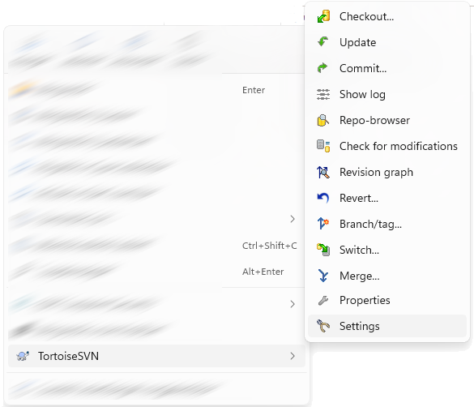
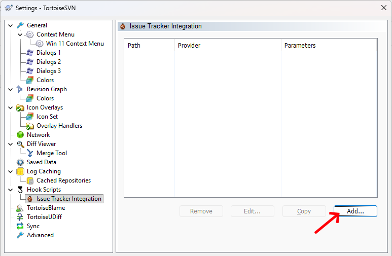
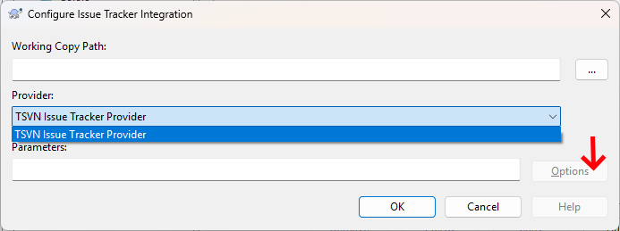
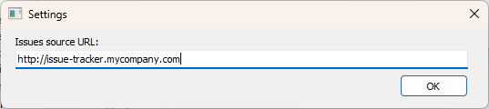
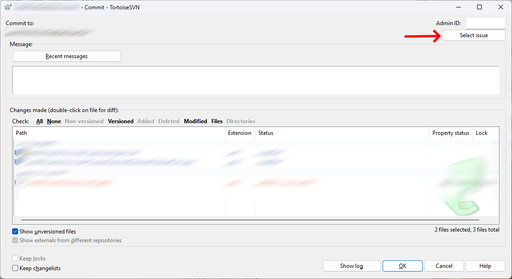
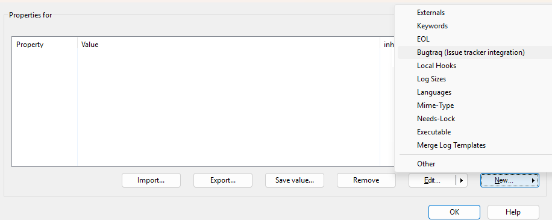
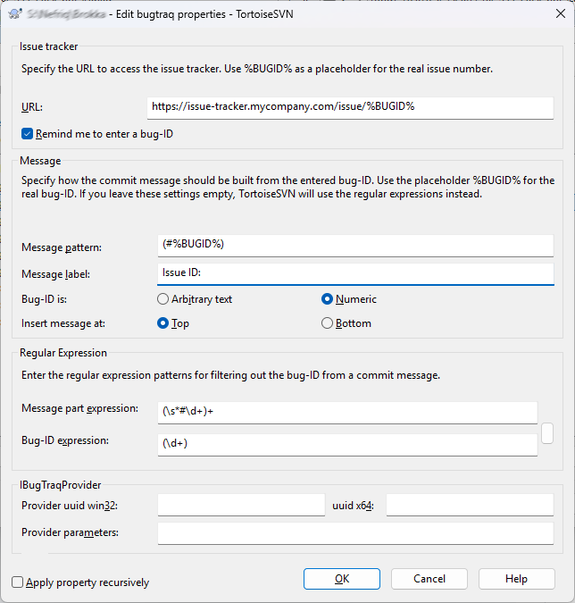

# SVN BugTraq Delphi Provider

Delphi-based TortoiseSVN BugTraq provider for custom issue tracker integration.

---

## Overview

This project provides a lightweight BugTraq provider for TortoiseSVN written in Delphi.

It allows you to connect any external issue tracking system (or custom API) to the TortoiseSVN commit workflow. Issues are fetched from an HTTP endpoint and can be selected during commit, then automatically inserted into the commit message.

---

## Features

* Integration with TortoiseSVN BugTraq interface
* Custom HTTP/JSON endpoint support
* Issue selection dialog with grid view
* Configurable endpoint URL
* Minimal dependencies (WinInet-based)
* Supports x86 and x64 builds

---

## How it works

1. TortoiseSVN invokes the provider during commit
2. The provider opens a custom dialog
3. The dialog loads issues from a configured URL
4. The user selects an issue
5. The selected issue is appended to the commit message

---

## Expected JSON format

The current implementation expects the JSON objects to contain these exact field names.

The endpoint must return a JSON array like this:

```json
[
  {
    "partner": "Example",
    "id": 123,
    "desc": "Fix login bug"
  },
  {
    "partner": "Example",
    "id": 124,
    "desc": "Add new feature"
  }
]
```

### Fields

* `id` → used as SVN **BUGID**
* `desc` → appended to commit message
* `partner` → optional, displayed in the grid

---

## Installation

### 1. Build

Compile the project for both architectures:

* Win32 (x86)
* Win64 (x64)

---

### 2. Register the DLL

The DLL must be registered using `regsvr32` **with administrator privileges**.

```bat
regsvr32 SVNBugTraqProvider_x64.dll
```

> ⚠️ Important:
>
> * Run command prompt as **Administrator**
> * Use the correct version of `regsvr32`
>
>   * `System32` → 64-bit
>   * `SysWOW64` → 32-bit

To unregister the DLL:

```bat
regsvr32 /u SVNBugTraqProvider_x64.dll
```

---

## Configuration in TortoiseSVN

### 1. Open context menu



---

### 2. Open Issue Tracker settings



---

### 3. Register the provider



---

### 4. Configure the custom endpoint URL



---

## Commit Window Integration

The provider adds an extra **Select issue** button to the TortoiseSVN commit window.

This screenshot shows where the additional button appears during the commit workflow.



---

## Issue Tracker Integration (Important)

This provider uses the `id` field from the JSON response as the SVN **BUGID** value.

To make issue IDs clickable in commit messages, you must configure TortoiseSVN's built-in BugTraq properties separately.

---

### 6. Add BugTraq integration properties



---

### 7. Configure BugTraq details



---

This configuration is independent from the provider, but required for clickable issue links.

---

## Usage

1. Start a commit in TortoiseSVN
2. Click **Select issue**
3. Choose an item from the list
4. The issue description will be added to the commit message

---

## Configuration format

The provider stores configuration as a parameter string:

```
url=https://your-server/api/issues
```

---

## Notes

* HTTPS certificate validation can be ignored (configurable in code)
* Network errors will raise exceptions
* JSON parsing is minimal and expects valid input
* Designed for simple integrations and custom APIs

---

## Limitations

* No advanced JSON parsing (flat structure expected)
* No pagination or filtering
* No built-in authentication UI

---

## Project structure

* `BugTraqProviderUnit` → COM provider implementation
* `SelectTicketFormUnit` → issue selection dialog
* `OptionsUnit` → configuration dialog
* `HttpClientUnit` → HTTP client (WinInet)

---

## Download

Precompiled binaries are available in the [Releases](../../releases) section.

---

## License

This project is licensed under the MIT License. See the [LICENSE](LICENSE) file for details.

---

## Why this exists

Integrating a custom issue tracker into TortoiseSVN using Delphi is poorly documented and unnecessarily difficult.

This project provides a working, minimal example so others don’t have to figure it out from scratch.
